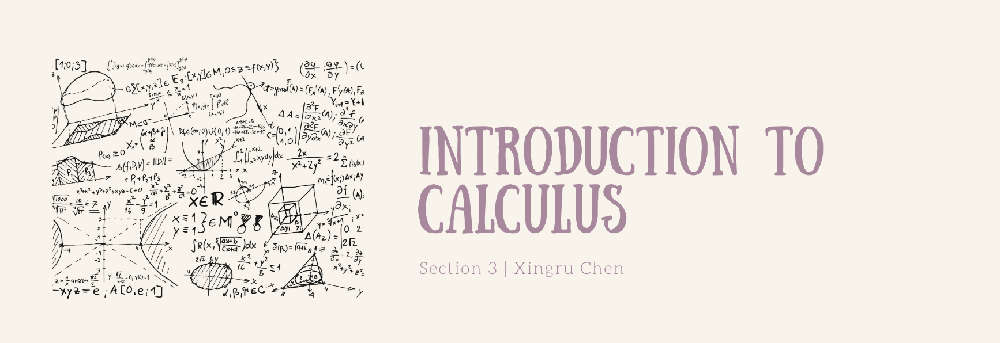

# math1.io
Math 1: Calculus @ Dartmouth College

### Slides 
> #### Click :pancakes: &nbsp; :fried_egg: &nbsp; :ice_cream: to download

* #### Week One

  * Functions and Graphs [:pancakes:](https://github.com/fudab/Math-1/blob/master/slides/pdf/M1_Lec1.pdf) &nbsp; &nbsp; Operations on Functions, Even and Odd Functions [:pancakes:](https://github.com/fudab/Math-1/blob/master/slides/pdf/M1_Lec2.pdf) &nbsp; &nbsp; Library of Functions [:pancakes:](https://github.com/fudab/Math-1/blob/master/slides/pdf/M1_Lec3.pdf)

* #### Week Two

  * Average Rate of Change, Constructing a Function Which Describes a Model [:pancakes:](https://github.com/fudab/Math-1/blob/master/slides/pdf/M1_Lec4.pdf) &nbsp; &nbsp; Composite Functions [:pancakes:](https://github.com/fudab/Math-1/blob/master/slides/pdf/M1_Lec5.pdf) &nbsp; &nbsp; Trigonometric Functions [:pancakes:](https://github.com/fudab/Math-1/blob/master/slides/pdf/M1_Lec6.pdf)

* #### Week Three

  * Inverse Functions [:pancakes:](https://github.com/fudab/Math-1/blob/master/slides/pdf/M1_Lec7.pdf) &nbsp; &nbsp; Exponential and Logarithmic Functions [:pancakes:](https://github.com/fudab/Math-1/blob/master/slides/pdf/M1_Lec8.pdf) &nbsp; &nbsp; Sequences [:pancakes:](https://github.com/fudab/Math-1/blob/master/slides/pdf/M1_Lec9.pdf)
  
* #### Week Four
  
  * Limit of a Sequence [:fried_egg:](https://github.com/fudab/Math-1/blob/master/slides/pdf/M1_Lec10.pdf) &nbsp; &nbsp; Bounded and Convergent Sequences [:fried_egg:](https://github.com/fudab/Math-1/blob/master/slides/pdf/M1_Lec11.pdf) &nbsp; &nbsp; Limit of a Function [:fried_egg:](https://github.com/fudab/Math-1/blob/master/slides/pdf/M1_Lec12.pdf)
  
* #### Week Five

  * Limit Laws [:fried_egg:](https://github.com/fudab/Math-1/blob/master/slides/pdf/M1_Lec13.pdf) &nbsp; &nbsp; Continuity [:fried_egg:](https://github.com/fudab/Math-1/blob/master/slides/pdf/M1_Lec14.pdf) &nbsp; &nbsp; Intermediate Value Theorem and Squeeze Theorem [:fried_egg:](https://github.com/fudab/Math-1/blob/master/slides/pdf/M1_Lec15.pdf)
  
* #### Week Six

  * Defining the Derivative [:fried_egg:](https://github.com/fudab/Math-1/blob/master/slides/pdf/M1_Lec16.pdf) &nbsp; &nbsp; The Derivative as a Function [:fried_egg:](https://github.com/fudab/Math-1/blob/master/slides/pdf/M1_Lec17.pdf) &nbsp; &nbsp; Limits, Continuity, and Differentiability [:fried_egg:](https://github.com/fudab/Math-1/blob/master/slides/pdf/M1_Lec18.pdf)
  

* #### Week Seven

  * Basic Rules for Derivatives [:ice_cream:](https://github.com/fudab/Math-1/blob/master/slides/pdf/M1_Lec19.pdf) &nbsp; &nbsp; Product and Quotient Rules [:ice_cream:](https://github.com/fudab/Math-1/blob/master/slides/pdf/M1_Lec20.pdf) &nbsp; &nbsp; Derivatives of Trig Functions [:ice_cream:](https://github.com/fudab/Math-1/blob/master/slides/pdf/M1_Lec21.pdf) 
  
* #### Week Eight

  * The Chain Rule [:ice_cream:](https://github.com/fudab/Math-1/blob/master/slides/pdf/M1_Lec22.pdf) &nbsp; &nbsp; Implicit Differentiation [:ice_cream:](https://github.com/fudab/Math-1/blob/master/slides/pdf/M1_Lec23.pdf) &nbsp; &nbsp; Derivatives of Inverse Trig Functions [:ice_cream:](https://github.com/fudab/Math-1/blob/master/slides/pdf/M1_Lec24.pdf) 
  
* #### Week Nine

  * Derivatives of Exp and Log Functions [:ice_cream:](https://github.com/fudab/Math-1/blob/master/slides/pdf/M1_Lec25.pdf)

### Homework 
> #### Click the emoji to download

* #### Week One 

  * Homework 1 [:envelope:](https://github.com/fudab/Math-1/blob/master/homework/M1_HW1.pdf)  &nbsp; &nbsp; Solution [:incoming_envelope:](https://github.com/fudab/Math-1/blob/master/homework/solution/M1_HW1_Solution.pdf) &nbsp; &nbsp; &nbsp; &nbsp; &nbsp; &nbsp; Homework 2 [:envelope:](https://github.com/fudab/Math-1/blob/master/homework/M1_HW2.pdf)  &nbsp; &nbsp; Solution [:incoming_envelope:](https://github.com/fudab/Math-1/blob/master/homework/solution/M1_HW2_Solution.pdf) &nbsp; &nbsp; &nbsp; &nbsp; &nbsp; &nbsp; Homework 3 [:envelope:](https://github.com/fudab/Math-1/blob/master/homework/M1_HW3.pdf)  &nbsp; &nbsp; Solution [:incoming_envelope:](https://github.com/fudab/Math-1/blob/master/homework/solution/M1_HW3_Solution.pdf)
  
* #### Week Two

 * Homework 4 [:envelope:](https://github.com/fudab/Math-1/blob/master/homework/M1_HW4.pdf)  &nbsp; &nbsp; Solution [:incoming_envelope:](https://github.com/fudab/Math-1/blob/master/homework/solution/M1_HW4_Solution.pdf) &nbsp; &nbsp; &nbsp; &nbsp; &nbsp; &nbsp; Homework 5 [:envelope:](https://github.com/fudab/Math-1/blob/master/homework/M1_HW5.pdf)  &nbsp; &nbsp; Solution [:incoming_envelope:](https://github.com/fudab/Math-1/blob/master/homework/solution/M1_HW5_Solution.pdf) &nbsp; &nbsp; &nbsp; &nbsp; &nbsp; &nbsp; Homework 6 [:envelope:](https://github.com/fudab/Math-1/blob/master/homework/M1_HW6.pdf)  &nbsp; &nbsp; Solution [:incoming_envelope:](https://github.com/fudab/Math-1/blob/master/homework/solution/M1_HW6_Solution.pdf)
  
* #### Week Three

  * Homework 7 [:envelope:](https://github.com/fudab/Math-1/blob/master/homework/M1_HW7.pdf)  &nbsp; &nbsp; Solution [:incoming_envelope:](https://github.com/fudab/Math-1/blob/master/homework/solution/M1_HW7_Solution.pdf) &nbsp; &nbsp; &nbsp; &nbsp; &nbsp; &nbsp; Homework 8 [:envelope:](https://github.com/fudab/Math-1/blob/master/homework/M1_HW8.pdf)  &nbsp; &nbsp; Solution [:incoming_envelope:](https://github.com/fudab/Math-1/blob/master/homework/solution/M1_HW8_Solution.pdf) &nbsp; &nbsp; &nbsp; &nbsp; &nbsp; &nbsp; Homework 9 [:envelope:](https://github.com/fudab/Math-1/blob/master/homework/M1_HW9.pdf)  &nbsp; &nbsp; Solution [:incoming_envelope:](https://github.com/fudab/Math-1/blob/master/homework/solution/M1_HW9_Solution.pdf)
  
  
### Exams 

> #### Click :package: to download

* #### Midterm 1 [:package:](https://github.com/fudab/Math-1/blob/master/exams/Midterm1.pdf)
* #### Midterm 2 [:package:](https://github.com/fudab/Math-1/blob/master/exams/Midterm2.pdf)
* #### Final [:package:](https://github.com/fudab/Math-1/blob/master/exams/Final.pdf) 

